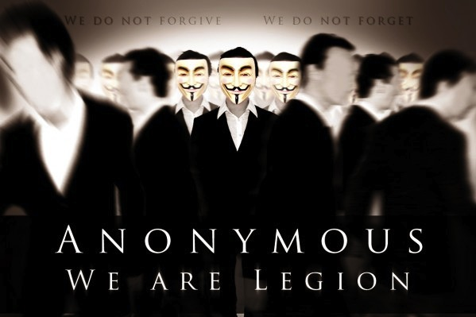
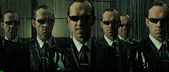
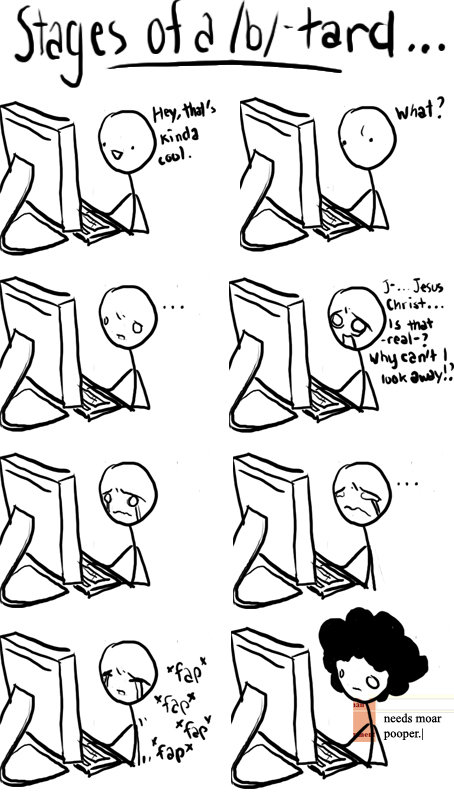
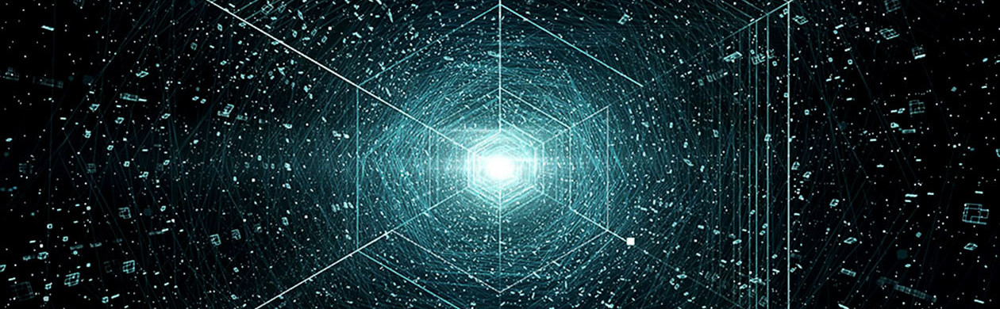
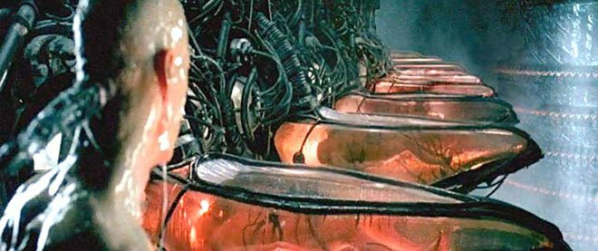
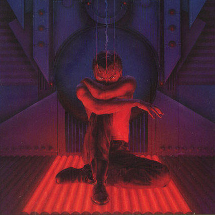
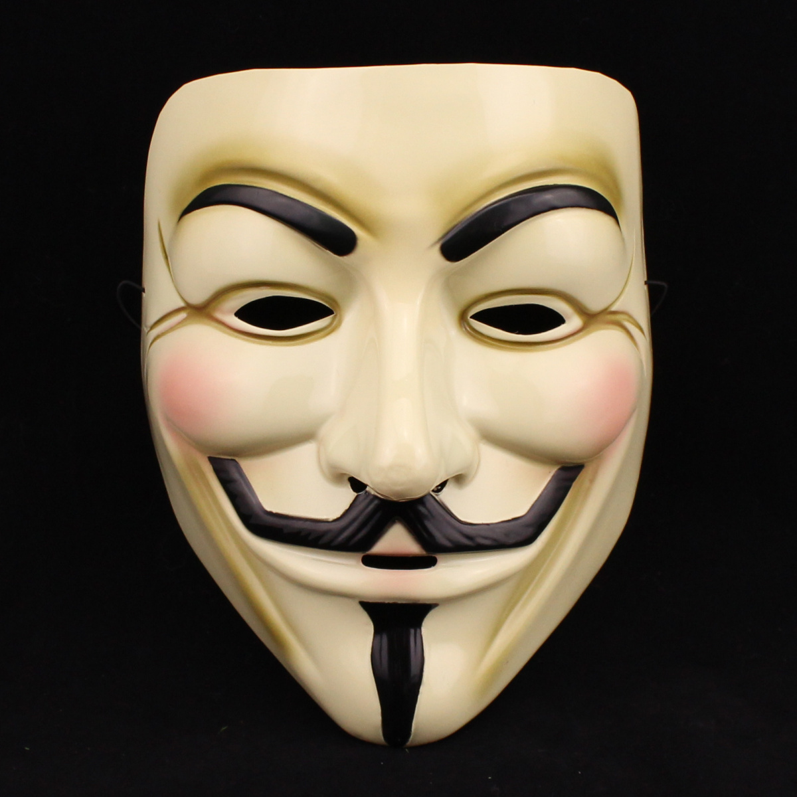
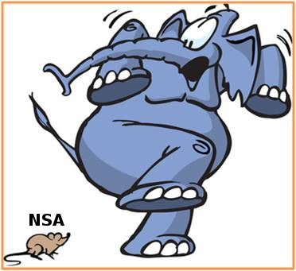
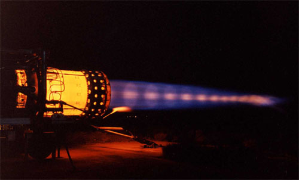

---
# United as one, divided by zero

---
# United as one, divided by zero

---
# whoami

--
- The youngest of the old cypherpunks?

--
- During the first crypto war, I was learning QBasic

--
- Computer Security, Conspiracy, Law, Magic

---

  

---
# Welcome to The Cypherdrome

  

--
- You can become completely anonymous on the net*

--
- Anonymous money, anonymous marketplaces

--
- No assasination markets

--
- Anonymity is Freedom

---
# Anonymity is Isolation

--
- In a closed society where everybody's guilty, the only crime is getting caught

--
- Be a little slow, be a little late, just once

--
- Blackmail Dictatorship

---

---

---
# First wave

--
- Privacy

--
- Anonymity

--
- Peer to Peer

--
- Trust noone/everyone

---
# Second wave

--
- Everyone knows everything

--
- No single point of failure

--
- Reduce trust but use your social network

--
- Resilient to infiltration

---
# What Technologies?

--
- We have designed a lot of irrelivant technology

--
- Look at the success cases (and failures)

--
- Sharing and Commons models are winning

--
- Federation model

--
- Scope creep in security is Paranoia

---

---
# You are here

--

@cjdelisle cjd@cjdns.fr
